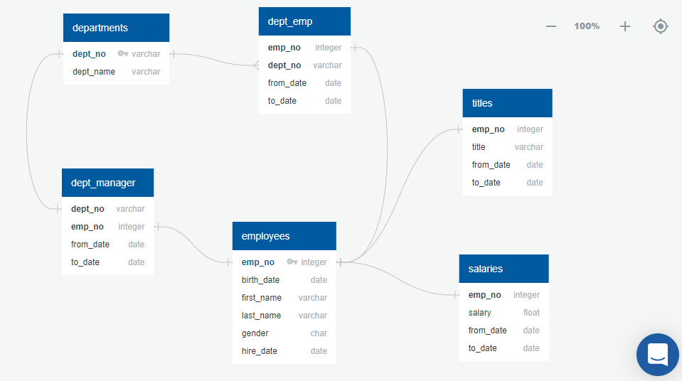

# ETL Challenge - The Employees Database

## Objective: 

- The goal is to design tables to hold the data, import the employees data from numerous CSV files into the tables in SQL database, and execute queries/perform analysis to answer questions about the data and find meaningful information. 
- Follow ETL process to extract, transform and load the data into the database.

## Steps

- #### Data Modeling
Inspected the CSV files and sketch out an ERD (Entity Relationship Diagram) of the tables using a tool - http://www.quickdatabasediagrams.com

- #### Data Engineering
Used the information to create a table schema for each of the CSV files and created data types, primary keys, foreign keys, and other constraints.
Imported each CSV file into the corresponding SQL table. 

- #### Data Analysis
Succesfully executed numerous SQL queries to perform analysis on data

 

